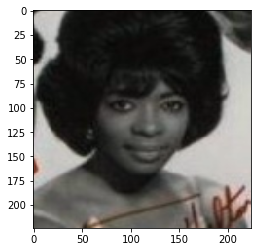
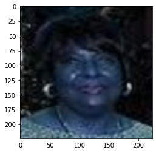
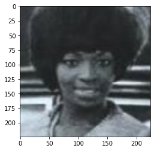
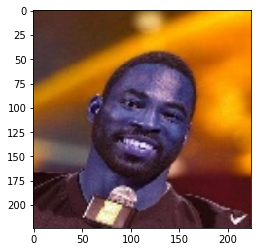
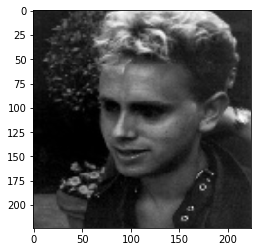
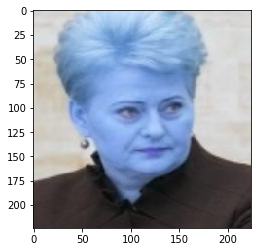
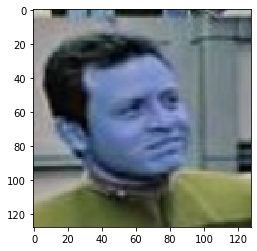
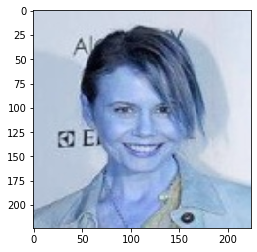
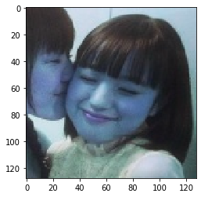

# one-shot-learning

## Some results of face verification are given below
the outputs would be either True or False which are described below

True : corresponding to the two person to be same

False : corresponding to the two person to be different

### sample 1:

the model output was True 

### sample 2:

the model output was False

### sample 3:

the model output was False

## sample 4:

the model output was True

## sample 5:

the model output was False
