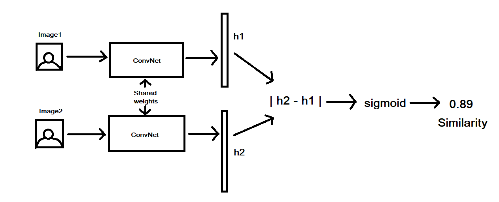

# Face recognition 

## siamese network:

Classification networks are not sufficient for recognition purposes due to two main factors:

1. deep learning algorithms are very data hungry and it is very hard to maintain large data for each individual

2. even if we have a dataset that is enough individual person wise it is very hard to collect data for the the unrecognised class (individuals not in the database.).

The two concepts of face recognition and face verification are different. face verification is the process which basically checks if the two instances are of the same person or are from different person while face recognition checks if the given person is from some defined set of individuals or not and if it is who is that person. thus both the problems are completely different problems.  

The siamese network is a CNN based network where two images are passed through the network and the network learns to produce encoding for the images. the basic though behind it is that if the two images are of the same person then the netowork will create feature map which are similar to one another however if they are different then the feature maps will be different. Triplet loss function is used as the loss function for the training. However in this implementation we are using a variation of the network where the encoding of the two images are subtracted elemen wise and their L2 norm is calculated and the result is passed onto a sigmoid function which then gives a similarity value. If the output is greater than 0.5 then the images are from the same person and if otherwise then the other condition is considered. 

The network we are training is a face verification system. It outputs th similarity value between the two instances inserted

## Some results of face verification are given below
the outputs would be either True or False which are described below

True : corresponding to the two person to be same

False : corresponding to the two person to be different

### sample 1:

the model output was True 

### sample 2:

the model output was False

### sample 3:

the model output was False

## sample 4:

the model output was True

## sample 5:

the model output was False
